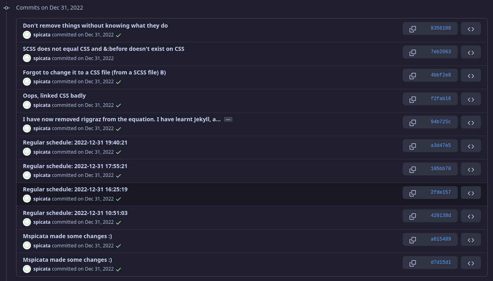

i'm not only talking for myself when I say that i'm getting pretty sick of the way that the town members will continue to ask questions that they could easily find their own answers to, and the lack acceptance of advice when we give it.

this is a larger problem for the town members that joined later.

[i really do hate this trend]: #

## how we got here?

okay, so i'm gonna make some very big assumptions here, but this is how *i* think that we got here.

ed and i have been here for quite a while. most of that time was spent alone, or with just the two of us. however, we've come to use radically different systems, so we've grown almost independently. as a result of our lonely days, we've kind of just had to rely on ourselves.

you might be able to see this still nowadays. we are pretty open about the changes of our websites, but most of it goes underground. and slowly. particularly slowly.

---

case study: my website

this might be looking at the development at my website with rose-tinted glasses, however, i don't have another suitable candidate, as ed's website is privated.

(jun 25th 2022 to sep 17th 2022) i made my first website on 11ty-garden. i to this day have not a single clue how it works, but it did. by doing this, i was kind of introduced into the world of SSGs. also, my first website was hosted on netlify, which was an experience. i learnt how to change css, and a bit of html, thought i had my struggles with it.

(sep 12th 2022 to dec 31st 2022) after i got sick and tired of 11ty garden, i moved to using jekyll, specifically [riggraz's no styles theme](https://riggraz.dev/no-style-please/). by doing so, i got to learn about how themes, and also jekyll, work. it was definitely a rough journey, and most of the things were botched together. it wasn't pretty. 

(dec 31st 2022 onwards) this got pretty messy after thing. tired of using other people's templates, i decided to go by myself, and so i learned how to learn jekyll, and i finally removed riggraz's theme. i was standing on my own two legs finally!

(pictures in reverse chronological order, so the commit i remove riggraz will be lower down)

it turned out that the two legs were not very stable. and so i struggled quite a bit for that time. and so i had to learn even more.

most of this was done on my own. i dont say this to say that im better at making website than you, i'm most probably not. however, i did not have anyone to depend on, and so i needed to learn how to do things myself, and in doing so, i've learnt — or at least tricked myself into believing that i've learnt — what im doing.

this development took almost half a year. and i'm still learning. the average town member is very new. however... there is something else.

---

this development is pretty different from the development of the websites of the new town members. here's essentially the breakdown:

1. they hear of a community known as the town and wish to join. however, this requires a website, and so...
2. they make a website. of course, it's their own website, so they want to put in work into it. however, they also want to join the town as quickly as possible, and so they...
3. step 3, used a template. this would usually be quartz template, which holds a majority in the town[^1]

[^1]: however, i predict that the dominant may change to notion over time.

quartz is great. its simple to use, it delivers results fast, and you don't need to understand how it works, and it looks pretty. it's pretty cool. however, much like the primer and shan-mei, it is a preset theme, and once you've committed to it, you need to learn how to change it to match you.

there is a slight problem here. how do you get this complex thing you don't understand, and change it to fit you? additionally, how do you get a template that someone else gives you, and understand it?

## addressing the problem

story time is over, here are the key issues (imo):

1. people don't understand what they are working with
2. they haven't learnt to survive without it
3. lack of good documentation
4. dependence on others
5. overestimation of abilities

none of these are necessarily bad, however, it has led to this general idea that when you don't know, just ask someone better than you. that is a good idea, except it makes it so that the town members end up depending on others rather than figuring it out yourselves.

so, instead of us trying to focus on everyone, we just focus on one.
