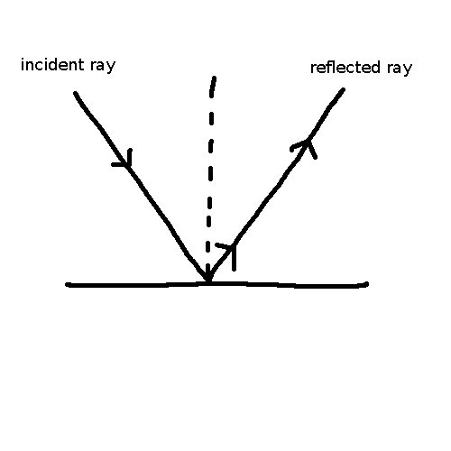
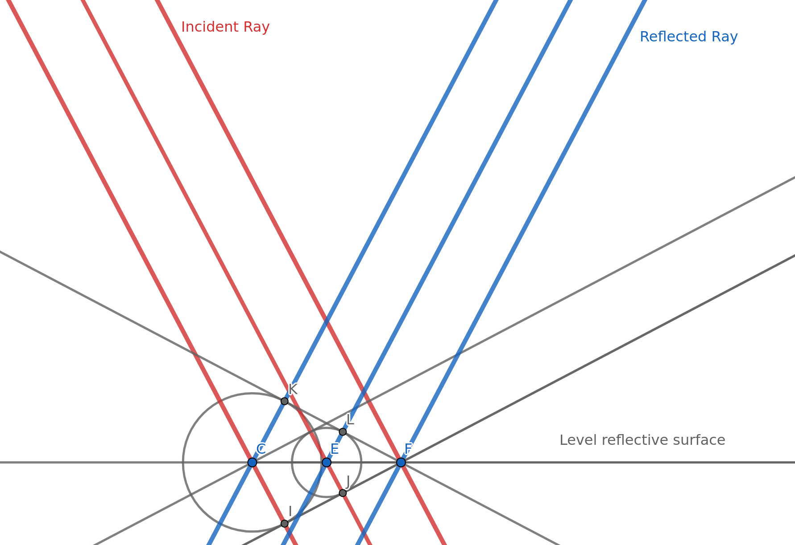
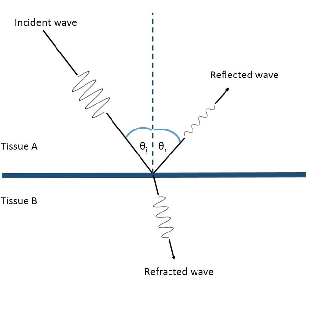

## Huygen's Principle

- Definition: At every point on a wavefront (of a wave), a semi-spherical wavelet in the direction of the wave. The next wavefront is perpendicular to all of the wavelets.
- Example: If you shine a ray of light into a glass prism, then you will see the ray of light 'bend', and change its direction (when it exits, it will bend again). Photo provided (hello Dr Waters, please ignore the strangeness of this image):

    
- Explanation: The wavelets travel slower in a slower medium. This leads to a smaller distances between wavefronts and the ray of light bends towards the medium. Huygen's principle.
- Example 2: When a light wave hits a reflective level surface, then the light is the reflected off of the surface.

    

- Explanation 2: When a wavefront hits a surface, then you can imagine another wavelet produced on each point of impact. Again, you can take the **locus** of all of these points to get the reflected wavefront.

    

- Key point: Using Huygen's principle, we are able to predict how waves interact with objects, whether that be through refraction, reflection, or diffraction. For these interactions, we can assume that a secondary wavelet is formed at the point of 'impact'. Using this, we are able to predict how a wave may behave. With refraction, the change in the speed of the wave allows us to calculate which way a wave will bend when entering a new medium. With reflection, we can predict how it reflects (abides by the law of reflection).

    

    (Wavefronts substituted for rays of light in order bring focus to the reflection)

## Snell's law

- Definition: $\frac{\sin \theta_{1}}{\sin \theta_{2}}=\frac{n_{2}}{n_{1}}=\frac{v_{1}}{v_{2}}$, where $\theta$ is the angle of incidence/refraction, $n$ is the refractive index, and $v$ is the velocity of the wave.
- Example 1: Same example as in Huygen's principle.
- Explanation: When a wave enters a slower medium, the wave slows down. Under Huygen's principle, the wavelets produced at each point of the wavefront also slow down, which leads to a smaller difference between the wavefront. However, as shown in the diagram, this slowing will also lead to a change in the direction. Slower mediums will change the angle of refraction to be closer to the medium.

    

- Key points: If a wave enters a slower medium, then the wave will bend towards the medium. i.e. the angle of refraction is smaller than the angle of incidence. On the other hand, if a wave enters a faster medium, then the wave will bend towards the medium, and hence the angle of refraction will be greater. However, the speed of the medium depends on the type of wave. For example, light travels fastest in a vacuum (or shan-mei apparently), and then will slow down in any other medium that is more dense, i.e. water. On the other hand, sound travels fastest in a very dense medium, such as steel, whereas it travels very slowly in air in comparison. Doesn't travel in vacuum at all. **Please note that the refractive index only applies to light.**

## Ultrasound Imaging

- Example: You go to a doctor. Maybe you're pregnant or some part of your body is not working properly. The doctor puts a probe onto your skin, and then makes an image of your internal structures (sonogram). They then use the sonogram to see what is up with you.
- Explanation: The probe used in ultrasound imaging produces high frequency sound waves --- above 20 Hz and usually between 2 MHz to 18 MHz. The high frequency sound waves emitted by the probe propagates through the human body, and when encountering a change in media, some of the energy is reflected back towards the probe (an echo); the rest will refract. This probe also picks up reflected sound waves through the piezoelectric effect i.e. When a mechanical stress (in this case sound) is exerted onto certain materials such as crystals, electricity builds up in the material.

    Media such as blood and other fluids reflect less energy, and so it appears darker in the sonogram. On the other hand, bones and other solid tissue reflect more energy, so they appear lighter.

    

- Process:

    1. Probes transmit high-frequency sound wave into the body.
    1. Sound waves travels through body until it hits a media boundary.
    1. Some of the energy is reflected back to the probe.
    1. These waves are picked up by the probe, and converted to electricity using the piezoelectric effect.
    1. This is inputted into a computer which uses the time taken, speed of medium, and the strength of reflected wave to calculate distance.
    1. It generates an image based of the data collected.

## Bibliography

- 1.7: Huygens’s Principle. (2016, November 1). Physics LibreTexts. https://phys.libretexts.org/Bookshelves/University_Physics/Book%3A_University_Physics_(OpenStax)/University_Physics_III_-_Optics_and_Modern_Physics_(OpenStax)/01%3A_The_Nature_of_Light/1.07%3A_Huygenss_Principle
- Cheng, J. (n.d.). Reflection | Radiology Reference Article | Radiopaedia.org. Radiopaedia. https://doi.org/10.53347/rID-55789
- HOW DOES ULTRASOUND WORK? (n.d.). Mayfair Diagnostics. Retrieved April 20, 2023, from https://www.radiology.ca/article/how-does-ultrasound-work/
- How Ultrasound Works. (2001, January 22). HowStuffWorks. https://science.howstuffworks.com/ultrasound.htm
- Huygens’ Principle. (n.d.). Retrieved April 20, 2023, from http://hyperphysics.phy-astr.gsu.edu/hbase/phyopt/huygen.html
- Huygens’ Principle Explains How Waves Move Around Corners. (n.d.). ThoughtCo. Retrieved April 20, 2023, from https://www.thoughtco.com/huygens-principle-2699047
- Huygens–Fresnel principle. (2023). In Wikipedia. https://en.wikipedia.org/w/index.php?title=Huygens–Fresnel_principle&oldid=1136391481
- Medical ultrasound. (2023). In Wikipedia. https://en.wikipedia.org/w/index.php?title=Medical_ultrasound&oldid=1150020621
- OpenStax | Free Textbooks Online with No Catch. (n.d.). Retrieved April 20, 2023, from https://openstax.org/
- Physics Tutorial: Snell’s Law of Refraction. (n.d.). Retrieved April 20, 2023, from https://www.physicsclassroom.com/Class/refrn/u14l2b.cfm
- Piezoelectricity. (2023). In Wikipedia. https://en.wikipedia.org/w/index.php?title=Piezoelectricity&oldid=1149884456
- Snell’s law. (2023). In Wikipedia. https://en.wikipedia.org/w/index.php?title=Snell%27s_law&oldid=1150459472
- Snell’s law | Definition, Formula, & Facts | Britannica. (n.d.). Retrieved April 20, 2023, from https://www.britannica.com/science/Snells-law
- Snell’s Law Formula | Definition and Examples. (n.d.). BYJUS. Retrieved April 20, 2023, from https://byjus.com/snells-law-formula/
- Themes, U. F. O. (2017a, April 2). Physics of Ultrasound. Radiology Key. https://radiologykey.com/physics-of-ultrasound-2/
- Themes, U. F. O. (2017b, April 2). Physics of Ultrasound. Radiology Key. https://radiologykey.com/physics-of-ultrasound-2/
- Ultrasound. (n.d.). National Institute of Biomedical Imaging and Bioengineering. Retrieved April 20, 2023, from https://www.nibib.nih.gov/science-education/science-topics/ultrasound